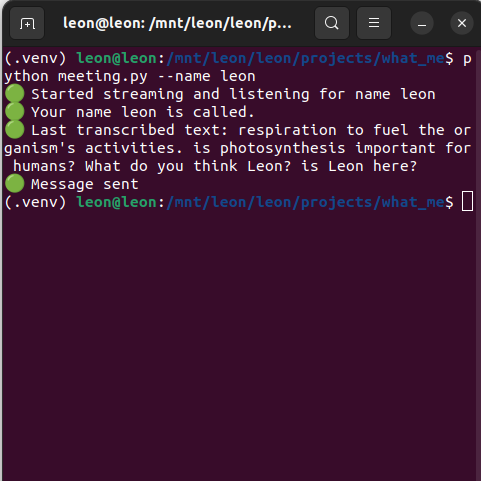

# Zoom meeting assistant
[Medium link]()

A handy app that listens attentively during your meetings, notifying you every time your name is mentioned, ensuring you never miss an important reference. Additionally, it can also intelligently detect and alert you when specific topics of interest are being discussed, keeping you informed and engaged in relevant conversations.

# How to install
1. Python and portaudio must be available.
2. pip install -r requirements.txt
3. rename ".env.example" to ".env"
4. Go to [Deepgram](https://deepgram.com/), create a free account, and create a new api, and copy this api key and paste it to the DEEPGRAM
5. Go to [Twilio](https://www.twilio.com/en-us) and create a free account.
   1. create a new free phone number and copy it to TWILIO_FROM_NUMBER
   2. Copy the account sid to TWILIO_ACCOUNT_SID
   3. Copy the twilio token to TWILIO_ACCOUNT_TOKEN in .env file.
6. Go to [OpenAI](https://platform.openai.com/) and create a new account and get the api key and fill to the OPENAI_API_KEY in the .env file.

Read detailed instructions [here]()

# How to use
## Name detection
`python meeting.py --name "YOUR_NAME"`

replace YOUR_NAME with the name you want to detect.

## Topic detection
`python meeting.py --topic "YOUR_TOPIC"`

replace YOUR_TOPIC with the topic you want to detect.
It can be a simple word or a sentence.

# Example
`python meeting.py --name leon`

After detecting your name, it sends you a message including the answer.

